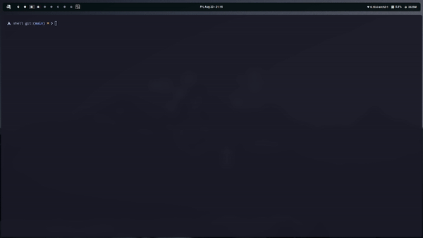

<div align="center">
    
</div>

<div align="center">
    <h1>SPRSHELL</h1>

<h4>A simply shell made in pure C.</h4>

</div>

<div align="center">
    
</div>

## Basic lifetime of a shell
Let's look at a shell from the top down. A shell does three main things in its lifetime.

- **Iniatialize:** In this step, a typical shell would read and execute its configuration files. These changes aspects of the shell's behavior.
- **Interpret:** Next, the shell reads commands from stdin (which could be interactive, or a file) and executes them.
- **Terminate:** After its commands are executed, the shell executes any shutdown commands, free ups any memory, and terminates.

## Basic loop of a shell
So we’ve taken care of how the program should start up. Now, for the basic program logic: what does the shell do during its loop? Well, a simple way to handle commands is with three steps:

- **Read:** Read the command from standard input.
- **Parse:** Separate the command string into a program and arguments.
- **Execute:** Run the parsed command.


## :wrench: Setup
To run the program automatically, run the setup.sh script (as root). The script will check if we have the necessary dependencies installed, and it will compile and run the program for us. 

>We must give it execution permissions if necessary:

```sh
$ chmod +x setup.sh
```

>And then run the script as root:

```sh
$ sudo setup.sh
```